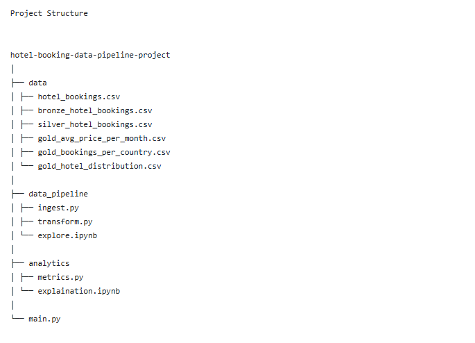

# Hotel Booking Data Engineering Pipeline

This project implements a complete Data Engineering pipeline to process and analyze hotel booking data using Python and Pandas.

The main objective of this project is to build an end-to-end data pipeline starting from raw data and ending with analytical insights.

The pipeline follows the Medallion Architecture:

Raw Data → Bronze Layer → Silver Layer → Gold Layer

---

 Project Architecture

The pipeline is structured into three main layers:

Bronze Layer

This layer stores the raw ingested data exactly as it is received from the source.

Silver Layer

In this stage the data is cleaned and transformed. Data quality checks and feature engineering are applied.

Gold Layer

The final layer contains aggregated analytical data that can be used for reporting, dashboards, or business insights.

---

## Project Structure

---
Pipeline Workflow

1. Data Ingestion (Bronze Layer)

The pipeline begins by loading the raw dataset using Pandas and saving it as a Bronze layer dataset.

This ensures that the original data is always preserved.

---

2. Data Exploration

Exploratory analysis was performed to understand the dataset before applying transformations.

The exploration step included:

- Checking dataset shape
- Inspecting data types
- Identifying missing values
- Detecting duplicates
- Identifying potential outliers

This step helps identify data quality issues before cleaning the data.

---
3. Data Cleaning and Transformation (Silver Layer)

Several data cleaning and data quality operations were applied:

- Removing duplicate records
- Handling missing values
- Dropping columns with excessive missing data
- Removing invalid price values
- Detecting and removing outliers
- Validating guest information

Feature Engineering

New features were created to enhance analysis:

- total_nights
- total_guests

After transformation, the cleaned dataset is stored as the Silver layer

---

 4. Data Analytics (Gold Layer)

The cleaned dataset is used to generate business metrics such as:

- Cancellation Rate
- Average Price per Month
- Top Countries by Bookings
- Hotel Type Distribution
- Average Stay Nights

These results are stored as Gold analytical tables for reporting and dashboards.

---

 Running the Pipeline

The entire pipeline can be executed with a single command:

python main.py

Pipeline flow:

Raw Data → Bronze → Silver → Gold

---

Some insights extracted from the dataset:

- Cancellation rate ≈ 27.6%
- City hotels receive more bookings than resort hotels
- Prices increase during summer months
- Average stay duration ≈ 3.6 nights

---

- Python
- Pandas
- Data Cleaning
- Feature Engineering
- Data Pipeline Design

---

- Integrate a SQL Data Warehouse
- Build a Streamlit Dashboard
- Automate pipeline scheduling

---

EMAN ABDELNABY
Aspiring Data Engineer

